# Flujo Completo de Documentos Electrónicos DIAN

## Diagrama de Flujo Principal

```mermaid
flowchart TB
    subgraph INICIO["🚀 INICIO"]
        A[Cargar Certificado Digital<br/>Andes SCD .pfx]
    end

    subgraph TIPO["📋 SELECCIÓN DE DOCUMENTO"]
        B{Tipo de<br/>Documento?}
        B -->|--tipo factura| C1[📄 FACTURA]
        B -->|--tipo credito| C2[📋 NOTA CRÉDITO]
        B -->|--tipo debito| C3[📋 NOTA DÉBITO]
    end

    subgraph FACTURA["📄 FACTURA ELECTRÓNICA"]
        C1 --> D1[Generar Número<br/>SETP + Consecutivo]
        D1 --> E1[Calcular CUFE<br/>SHA384 con ClaveTécnica]
        E1 --> F1[Crear XML Invoice<br/>UBL 2.1]
        F1 --> G1[InvoiceTypeCode: 01<br/>CustomizationID: 10]
    end

    subgraph NOTA_CREDITO["📋 NOTA DE CRÉDITO"]
        C2 --> REF2{¿Existe factura<br/>de referencia?}
        REF2 -->|No| ERR2[❌ Error: Requiere factura]
        REF2 -->|Sí| D2[Generar Número<br/>SETP + Consecutivo]
        D2 --> E2[Calcular CUDE<br/>SHA384 con PIN]
        E2 --> F2[Crear XML CreditNote<br/>UBL 2.1]
        F2 --> G2[CreditNoteTypeCode: 91<br/>CustomizationID: 20]
        G2 --> H2[Agregar DiscrepancyResponse<br/>+ BillingReference]
    end

    subgraph NOTA_DEBITO["📋 NOTA DE DÉBITO"]
        C3 --> REF3{¿Existe factura<br/>de referencia?}
        REF3 -->|No| ERR3[❌ Error: Requiere factura]
        REF3 -->|Sí| D3[Generar Número<br/>SETP + Consecutivo]
        D3 --> E3[Calcular CUDE<br/>SHA384 con PIN]
        E3 --> F3[Crear XML DebitNote<br/>UBL 2.1]
        F3 --> G3[DebitNoteTypeCode: 92<br/>CustomizationID: 30]
        G3 --> H3[Agregar DiscrepancyResponse<br/>+ BillingReference]
    end

    subgraph FIRMA["🔐 FIRMA XAdES-EPES"]
        G1 --> I[Firma Digital XAdES-EPES<br/>C14N Inclusivo + RSA-SHA256]
        H2 --> I
        H3 --> I
    end

    subgraph ENVIO["📤 ENVÍO A DIAN"]
        I --> J[Crear ZIP + Base64<br/>fv/nc/nd + número.zip]
        J --> K[SOAP 1.2 + WS-Security<br/>SendTestSetAsync]
        K --> L[Endpoint DIAN<br/>vpfe-hab.dian.gov.co]
    end

    subgraph RESPUESTA["📥 RESPUESTA"]
        L --> M{Recibir<br/>ZipKey?}
        M -->|Sí| N[Esperar 10-20 seg]
        M -->|No| O[❌ Error SOAP<br/>Verificar WS-Security]
        N --> P[GetStatusZip]
        P --> Q{Estado?}
        Q -->|IsValid=true| R[✅ AUTORIZADO<br/>StatusCode: 00]
        Q -->|IsValid=false| S[❌ RECHAZADO<br/>Ver ErrorMessage]
        Q -->|TestSet Aceptado| T[✅ HABILITACIÓN<br/>COMPLETADA]
    end

    A --> B

    style C1 fill:#4CAF50,color:#fff
    style C2 fill:#2196F3,color:#fff
    style C3 fill:#FF9800,color:#fff
    style R fill:#4CAF50,color:#fff
    style T fill:#4CAF50,color:#fff
    style S fill:#f44336,color:#fff
    style ERR2 fill:#f44336,color:#fff
    style ERR3 fill:#f44336,color:#fff
```



## Diagrama de Firma XAdES-EPES

```mermaid
flowchart TB
    subgraph INPUT["📥 ENTRADA"]
        XML["XML Documento<br/>(sin firma)"]
        KEY["🔐 Private Key"]
        CERT["📜 Certificado X.509"]
    end

    subgraph PASO1["PASO 1: Digest del Documento"]
        direction LR
        XML1["XML Completo"] --> C14N1["C14N Inclusivo"] --> SHA1["SHA-256"] --> DV1["DigestValue #1"]
    end

    subgraph PASO2["PASO 2: Insertar Estructura"]
        direction TB
        SIG["ds:Signature"]
        SI["ds:SignedInfo<br/>(3 References)"]
        SV["ds:SignatureValue<br/>(placeholder)"]
        KI["ds:KeyInfo<br/>(certificados)"]
        SP["xades:SignedProperties"]

        SIG --> SI
        SIG --> SV
        SIG --> KI
        SIG --> SP
    end

    subgraph PASO3["PASO 3: Digest de KeyInfo"]
        direction LR
        KI2["ds:KeyInfo<br/>+ namespaces heredados"] --> C14N2["C14N Inclusivo"] --> SHA2["SHA-256"] --> DV2["DigestValue #2"]
    end

    subgraph PASO4["PASO 4: Digest de SignedProperties"]
        direction LR
        SP2["xades:SignedProperties<br/>+ namespaces heredados"] --> C14N3["C14N Inclusivo"] --> SHA3["SHA-256"] --> DV3["DigestValue #3"]
    end

    subgraph PASO5["PASO 5: Firmar SignedInfo"]
        direction LR
        SI2["ds:SignedInfo<br/>(con 3 DigestValues)"] --> C14N4["C14N Inclusivo"] --> RSA["RSA-SHA256<br/>+ Private Key"] --> SIGVAL["SignatureValue"]
    end

    subgraph OUTPUT["📤 SALIDA"]
        XMLFIRM["XML Firmado<br/>✅ Listo para DIAN"]
    end

    INPUT --> PASO1
    PASO1 --> PASO2
    DV1 --> SI
    PASO2 --> PASO3
    PASO2 --> PASO4
    DV2 --> SI
    DV3 --> SI
    PASO3 --> PASO5
    PASO4 --> PASO5
    SIGVAL --> SV
    PASO5 --> OUTPUT

    style XML fill:#e3f2fd,stroke:#1565c0
    style KEY fill:#e3f2fd,stroke:#1565c0
    style CERT fill:#e3f2fd,stroke:#1565c0
    style DV1 fill:#fff8e1,stroke:#f57f17
    style DV2 fill:#fff8e1,stroke:#f57f17
    style DV3 fill:#fff8e1,stroke:#f57f17
    style SIGVAL fill:#fce4ec,stroke:#c2185b
    style XMLFIRM fill:#e8f5e9,stroke:#2e7d32
```



## Diagrama de Estructura XML

```mermaid
flowchart TB
    subgraph ROOT["📄 Documento UBL 2.1"]
        direction TB

        subgraph EXT["ext:UBLExtensions"]
            direction TB

            subgraph EXT1["UBLExtension #1"]
                DIAN["sts:DianExtensions"]
                IC["InvoiceControl<br/>(solo Facturas)"]
                IS["InvoiceSource: CO"]
                SW["SoftwareProvider"]
                SSC["SoftwareSecurityCode"]
                AP["AuthorizationProvider"]
                QR["QRCode"]
            end

            subgraph EXT2["UBLExtension #2"]
                FIRMA["ds:Signature<br/>🔐 XAdES-EPES"]
            end
        end

        subgraph META["📋 Metadatos"]
            VER["UBLVersionID: UBL 2.1"]
            CUST["CustomizationID:<br/>10/20/30"]
            PROF["ProfileID"]
            ID["ID: Número documento"]
            UUID["UUID: CUFE/CUDE"]
            DATE["IssueDate + IssueTime"]
            TYPE["TypeCode: 01/91/92"]
        end

        subgraph REFS["📎 Referencias (solo Notas)"]
            DISC["DiscrepancyResponse<br/>↑ PRIMERO"]
            BILL["BillingReference<br/>↓ DESPUÉS"]
        end

        subgraph PARTIES["👥 Participantes"]
            SUP["AccountingSupplierParty"]
            CUS["AccountingCustomerParty"]
        end

        subgraph MONEY["💰 Totales"]
            TAX["TaxTotal (IVA)"]
            TOT["LegalMonetaryTotal<br/>o RequestedMonetaryTotal"]
        end

        subgraph LINES["📦 Líneas"]
            LINE["InvoiceLine /<br/>CreditNoteLine /<br/>DebitNoteLine"]
        end
    end

    EXT --> META
    META --> REFS
    REFS --> PARTIES
    PARTIES --> MONEY
    MONEY --> LINES

    style DISC fill:#2196F3,color:#fff
    style BILL fill:#2196F3,color:#fff
    style FIRMA fill:#fce4ec,stroke:#c2185b
    style UUID fill:#fff8e1,stroke:#f57f17
```



## Requisitos TestSet Habilitación


## Diferencias CUFE vs CUDE

```mermaid
flowchart TB
    subgraph CUFE["📄 CUFE - Facturas"]
        direction TB
        CF1["NumFac + FecFac + HorFac"]
        CF2["+ ValFac + 01 + ValIVA"]
        CF3["+ 04 + ValINC + 03 + ValICA"]
        CF4["+ ValTotal"]
        CF5["+ NITEmisor + NITAdquiriente"]
        CF6["+ ClaveTécnica ⚠️"]
        CF7["+ TipoAmbiente"]
        CF8["= SHA384 → 96 hex"]

        CF1 --> CF2 --> CF3 --> CF4 --> CF5 --> CF6 --> CF7 --> CF8
    end

    subgraph CUDE["📋 CUDE - Notas Crédito/Débito"]
        direction TB
        CD1["NumDoc + FecDoc + HorDoc"]
        CD2["+ ValDoc + 01 + ValIVA"]
        CD3["+ 04 + ValINC + 03 + ValICA"]
        CD4["+ ValTotal"]
        CD5["+ NITEmisor + NITAdquiriente"]
        CD6["+ PIN Software ⚠️"]
        CD7["+ TipoAmbiente"]
        CD8["= SHA384 → 96 hex"]

        CD1 --> CD2 --> CD3 --> CD4 --> CD5 --> CD6 --> CD7 --> CD8
    end

    style CF6 fill:#f44336,color:#fff
    style CD6 fill:#f44336,color:#fff
    style CF8 fill:#4CAF50,color:#fff
    style CD8 fill:#4CAF50,color:#fff
```



## Uso con facho

### Factura
```python
from facho.fe.builders import InvoiceBuilder, InvoiceConfig, InvoiceData
from facho.fe.signing import XAdESSigner

config = InvoiceConfig(software_id="...", software_pin="...", ...)
builder = InvoiceBuilder(config)
xml = builder.build(invoice_data)

signer = XAdESSigner.from_pkcs12("cert.pfx", "password")
xml_signed = signer.sign(xml)
```

### Nota Crédito
```python
from facho.fe.builders import CreditNoteBuilder, CreditNoteData

credit_data = CreditNoteData(
    billing_reference_id="SETP990000001",  # Factura referencia
    billing_reference_uuid="abc123...",     # CUFE de factura
    discrepancy_response_code="2",          # Anulación
    ...
)
builder = CreditNoteBuilder(config)
xml = builder.build(credit_data)
```

### Nota Débito
```python
from facho.fe.builders import DebitNoteBuilder, DebitNoteData

debit_data = DebitNoteData(
    billing_reference_id="SETP990000001",
    billing_reference_uuid="abc123...",
    discrepancy_response_code="1",  # Intereses
    ...
)
builder = DebitNoteBuilder(config)
xml = builder.build(debit_data)
```

### Envío a DIAN
```python
from facho.fe.client import DianSimpleClient

client = DianSimpleClient("cert.pfx", "password", environment="habilitacion")
response = client.send_test_set_async("fvSETP990000001.zip", zip_content, test_set_id)

# Verificar estado
import time
time.sleep(20)
status = client.get_status_zip(response.zip_key)
print(f"IsValid: {status.is_valid}, StatusCode: {status.status_code}")
```
